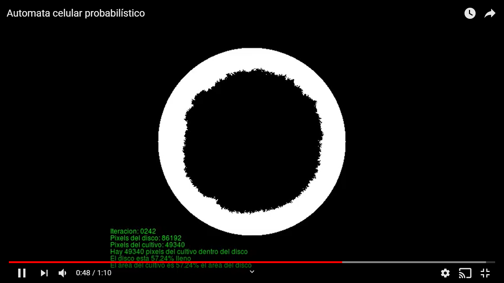

# Probabilistic cellular automaton culture with circular culture morphology

This package produces a video of the growth progression of a probabilistic cellular automaton culture.
The automata colony grows with a circular morphology. To measure how circular the morphology
is, a comparison is made at each iteration between a disk, drawin using Bresenham's circle algorithm,
and the colony.

In this [YouTube video](https://www.youtube.com/watch?v=46WZUcRUPEI) you can watch the automata colony growing in real time:

[](https://www.youtube.com/watch?v=46WZUcRUPEI)

You can also ready my [blog post](http://cienciadesatada.blogspot.com/2015/06/dibujando-circulos-aproximados-con-un.html) on the details of how the algorithm works.


## Installation

This package requires

```sh
apt-get install build-essential imagemagick avconv
```

## Usage example

To compile and create a video showing the mentioned progression, do:

```sh
make
make video
```

The resulting video will be saved in cell.mp4

## Contact info

**Oscar Mier**
- Github: [@voscarmv](https://github.com/voscarmv)
- Twitter: [@voscarmv](https://twitter.com/voscarmv)
- Linkedin: [Oscar Mier](https://www.linkedin.com/in/oscar-mier-072984196/) 

## 🤝 Contributing

Contributions, issues and feature requests are welcome!

Feel free to check the [issues page](../../issues/).

## Show your support

Give a ⭐️ if you like this project!
